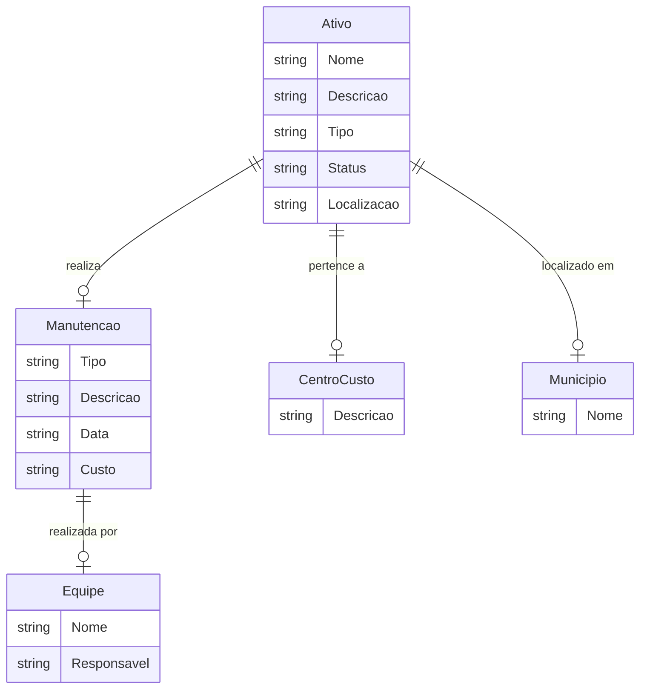

# MODELO CONCEITUAL

## Modelo Conceitual usando [Mermaid](https://mermaid.js.org/)

Modelo conceitual simplificando as entidades e focando em como elas se relacionam de maneira abstrata, sem detalhamento técnico:

