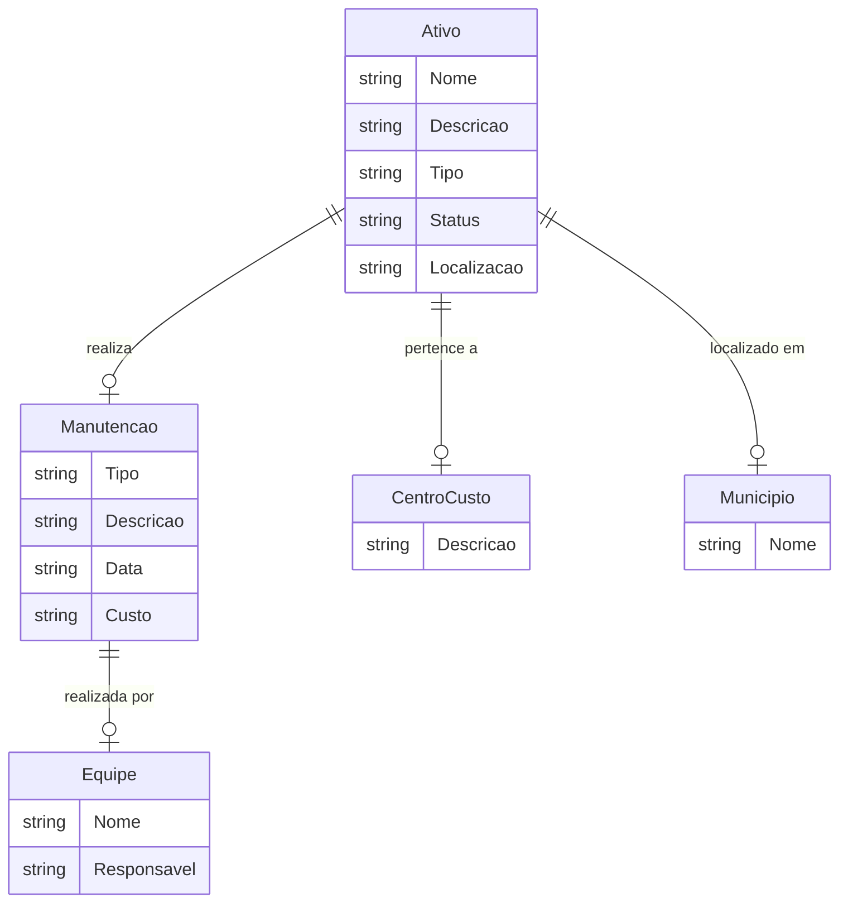

# Modelo Conceitual usando Mermaid

No modelo conceitual, vamos simplificar as entidades e focar em como elas se relacionam de maneira abstrata, sem detalhamento técnico.

# Modelo Conceitual usando PlantUML

No modelo conceitual com PlantUML, vamos abstrair os detalhes técnicos, assim como no exemplo com Mermaid.

@startuml
entity "Ativo" as ativo {
Nome : string
Descricao : string
Tipo : string
Status : string
Localizacao : string
}

entity "Manutencao" as manutencao {
Tipo : string
Descricao : string
Data : string
Custo : string
}

entity "Equipe" as equipe {
Nome : string
Responsavel : string
}

entity "CentroCusto" as centro_custo {
Descricao : string
}

entity "Municipio" as municipio {
Nome : string
}

ativo -- manutencao : "realiza"
manutencao -- equipe : "realizada por"
ativo -- centro_custo : "pertence a"
ativo -- municipio : "localizado em"

@enduml
