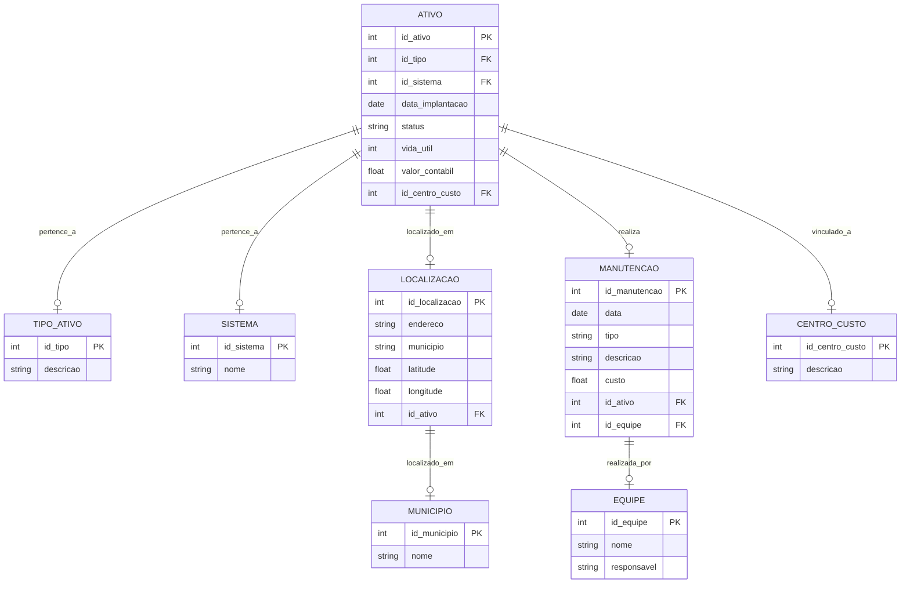

# MODELO LÓGICO

## Modelo Lógico usando [Mermaid](https://mermaid.js.org/)

Modelo lógico utilizando Mermaid, para o sistema de gestão de ativos de saneamento:

```mermaid
erDiagram
    ATIVO {
        int id_ativo PK
        int id_tipo FK
        int id_sistema FK
        date data_implantacao
        string status
        int vida_util
        float valor_contabil
        int id_centro_custo FK
    }

    TIPO_ATIVO {
        int id_tipo PK
        string descricao
    }

    SISTEMA {
        int id_sistema PK
        string nome
    }

    LOCALIZACAO {
        int id_localizacao PK
        string endereco
        string municipio
        float latitude
        float longitude
        int id_ativo FK
    }

    MANUTENCAO {
        int id_manutencao PK
        date data
        string tipo
        string descricao
        float custo
        int id_ativo FK
        int id_equipe FK
    }

    CENTRO_CUSTO {
        int id_centro_custo PK
        string descricao
    }

    EQUIPE {
        int id_equipe PK
        string nome
        string responsavel
    }

    MUNICIPIO {
        int id_municipio PK
        string nome
    }

    ATIVO ||--o| TIPO_ATIVO: pertence_a
    ATIVO ||--o| SISTEMA: pertence_a
    ATIVO ||--o| LOCALIZACAO: localizado_em
    ATIVO ||--o| MANUTENCAO: realiza
    ATIVO ||--o| CENTRO_CUSTO: vinculado_a
    MANUTENCAO ||--o| EQUIPE: realizada_por
    LOCALIZACAO ||--o| MUNICIPIO: localizado_em
```
